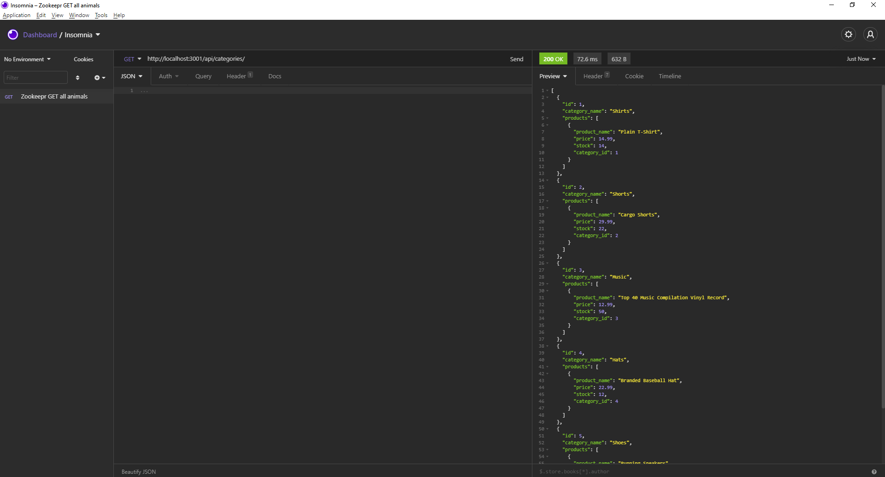
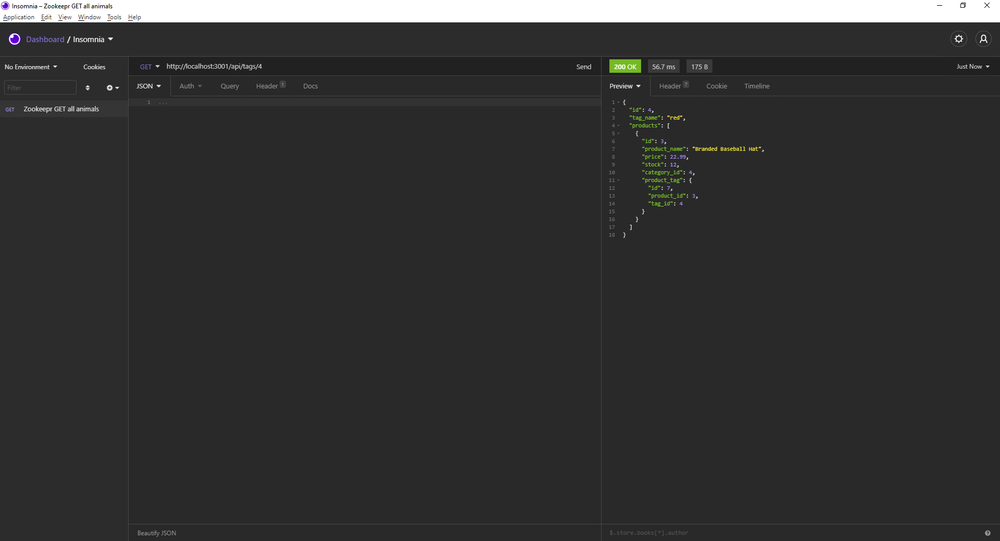
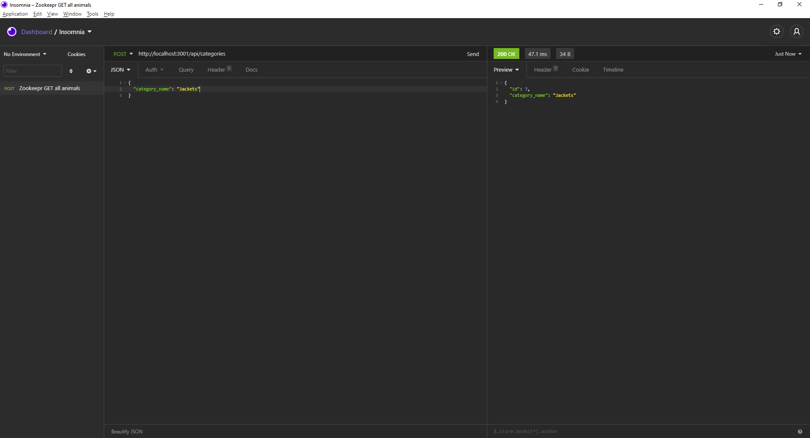
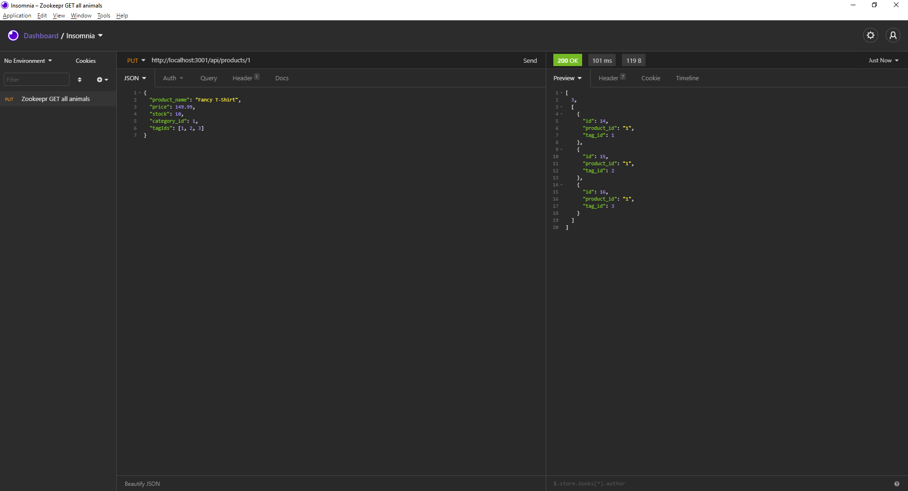
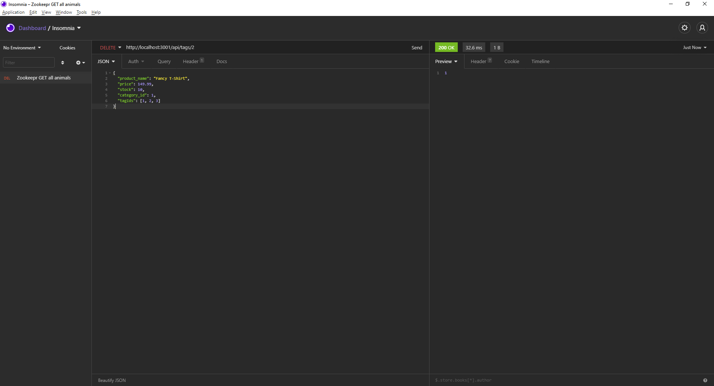

# E-commerce Back End
## Table of Contents
* [Description](#description)
* [Languages](#languages)
* [Walkthrough](#walkthrough)
* [Screenshots](#screenshots)
* [Questions](#questions)

## Description
This code provides the backend support for an E-Commerce web application. The application stores data on its products, categories, and tags via MySQL and Sequelize and runs on an Express.js routes that allow users to view, add, edit, and delete entries into the database.

## Languages
JavaScript, Node, Express, MySQL/Sequelize, Dotenv

## Walkthrough
https://drive.google.com/file/d/1Ty6ndEi6RcsDZPW_0twpXYTUgKPm-ja5/view

## Screenshots

## Questions
If you have any further questions about this application / repository feel free to contact me at: 
* [GitHub](https://github.com/jpkashlak)
* E-Mail: jpkashlak@gmail.com
